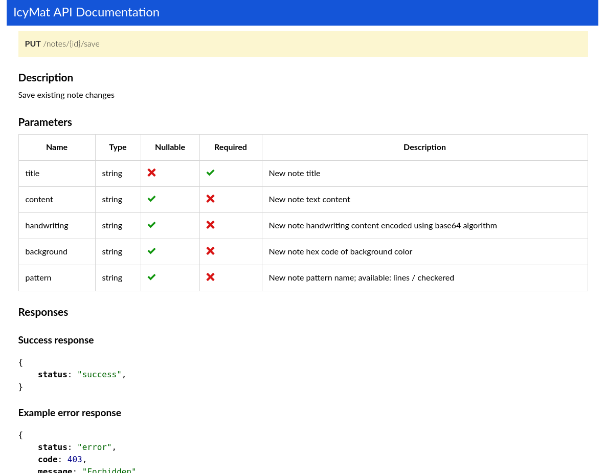

IcyMat API Documentation
========================

Simple library to generate API documentation using PHP Annotations.

How to use
---

Add PHP Doc comments to your Controller classes.

```php
<?php

namespace App\Controller;

...
use IcyMat\ApiDoc\Annotation\ApiMethod;
use IcyMat\ApiDoc\Annotation\ApiRoute;
use IcyMat\ApiDoc\Annotation\ApiDescription;
use IcyMat\ApiDoc\Annotation\ApiParams;
use IcyMat\ApiDoc\Annotation\ApiResponse;

class NotesController extends Controller
{
    /**
     * @ApiMethod(method="PUT")
     * @ApiRoute(name="/notes/{id}/save")
     * @ApiParams(name="title", type="string", nullable=false, required=true, description="New note title")
     * @ApiParams(name="content", type="string", nullable=true, required=false, description="New note text content")
     * @ApiParams(name="handwriting", type="string", nullable=true, required=false, description="New note handwriting content encoded using base64 algorithm")
     * @ApiParams(name="background", type="string", nullable=true, required=false, description="New note hex code of background color")
     * @ApiParams(name="pattern", type="string", nullable=true, required=false, description="New note pattern name; available: lines / checkered")
     * @ApiDescription(section="Notes", description="Save existing note changes")
     *
     * @ApiResponse(description="Success response", response="{'status': 'success'}")
     * @ApiResponse(description="Example error response", response="{'status': 'error', 'code': 403, 'message': 'Forbidden'}")
     */
    public function noteSave(Note $note, NotesManager $notesManager, Request $request)
    {
        if ($note->getUser() != $this->getUser()) {
            return new JsonResponse(['status' => 'error', 'code' => 'notes_01', 'message' => 'Access denied'], 403);
        }

        $notesManager->saveNoteFromRequest($note, $request);

        return new JsonResponse(['status' => 'success']);
    }
}
```

To generate doc you should use command

```bash
php vendor/bin/api_docs_generator sourceDirectory destinationDirectory
```

After this operation in `destinationDirectory/documentation.html` you can find all documented methods.

